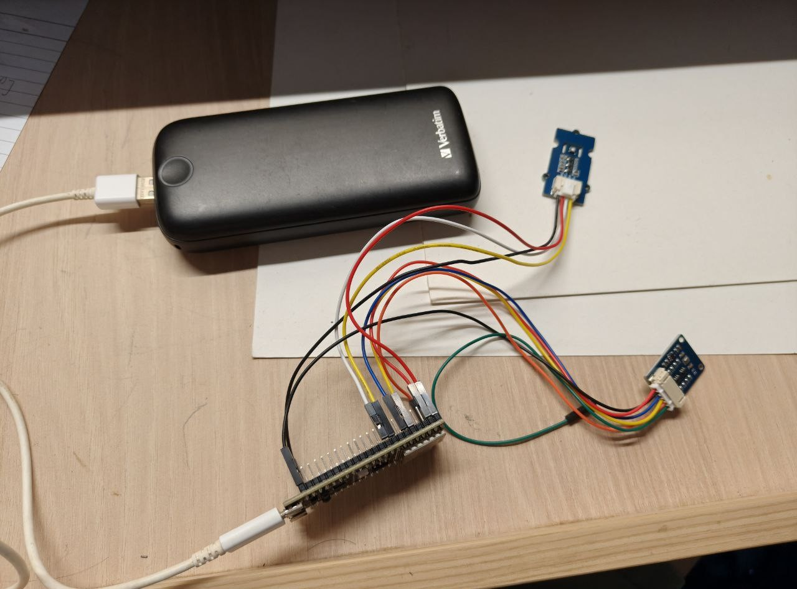

# _Weather station_

This is the program for an ESP32S2 weather station, which takes in environment sensor readings and transmits them to a connected device.

The program is to be run together with the following:

* A [back-end server](https://github.com/jemehgoh/weatherstationserver.git) that receives and stores the sensor readings.
* A [Web interface](https://github.com/jemehgoh/weather-station-frontend.git) from which the readings can be viewed.

## Acknowledgements

This program makes use of the following APIs:

* The [ESP-IDF framework](https://github.com/espressif/esp-idf) licensed under the Apache 2.0 license.

* Bosch Sensortec [BME280 sensor API](https://github.com/boschsensortec/BME280_SensorAPI.git) licensed under the BSD 3-Clause license.

In addition, parts of the program were derived from the following examples:

* The Wi-Fi code example from the [Getting Started with Wi-Fi on ESP-IDF](https://developer.espressif.com/blog/getting-started-with-wifi-on-esp-idf/) tutorial.

* The [esp_http_client code example](https://github.com/espressif/esp-idf/tree/v5.4.1/examples/protocols/esp_http_client).

## Hardware

The components used for the weather station are as follows:

* [ESP32-S2-DevKitC-1](https://docs.espressif.com/projects/esp-idf/en/v5.2/esp32s2/hw-reference/esp32s2/user-guide-s2-devkitc-1.html#esp32-s2-devkitc-1) development board

* BME280 sensor 

* SGP30 sensor

The components are connected as in the picture below:



## Setup

### Hardware setup

The physical components are connected as follows:

BME280 sensor board:

* GND - to ground
* ADDR/MISO - to ground
* VCC - to 3V3

The SCL and SDA pins are connected to the numbered pins as specified in the `BME280_SCL_PIN` and `BME280_SDA_PIN` macros in `main.c`.

SGP30 sensor board:

* GND and VCC to GND and 3V3 on the ESP32 respectively
* SCL and SDA pins connected to the numbered pins as specified in the `SGP30_SCL_PIN` and `SGP30_SDA_PIN` macros in `main.c`.

### Software setup

1. Ensure that you have the ESP-IDF extension for VS Code installed.

2. In the `Example Connection Configuration` section of the SDK configuration editor, set the *WiFi SSID* and *WiFi password* attributes to that of the network you are using.

3. In `main.c`, set `HTTP_HOST` and `HTTP_POST_URL` to the following:
```
#define HTTP_HOST "<IP address of device running the local server>:8080"  
#define HTTP_POST_URL "http://<HTTP_HOST>/post
```

4. Start the local server for the weather station as described [here](https://github.com/jemehgoh/weatherstationserver/blob/master/README.md).

5. Build and flash the program on the ESP32 with the `ESP-IDF: Build, Flash and Monitor` command.